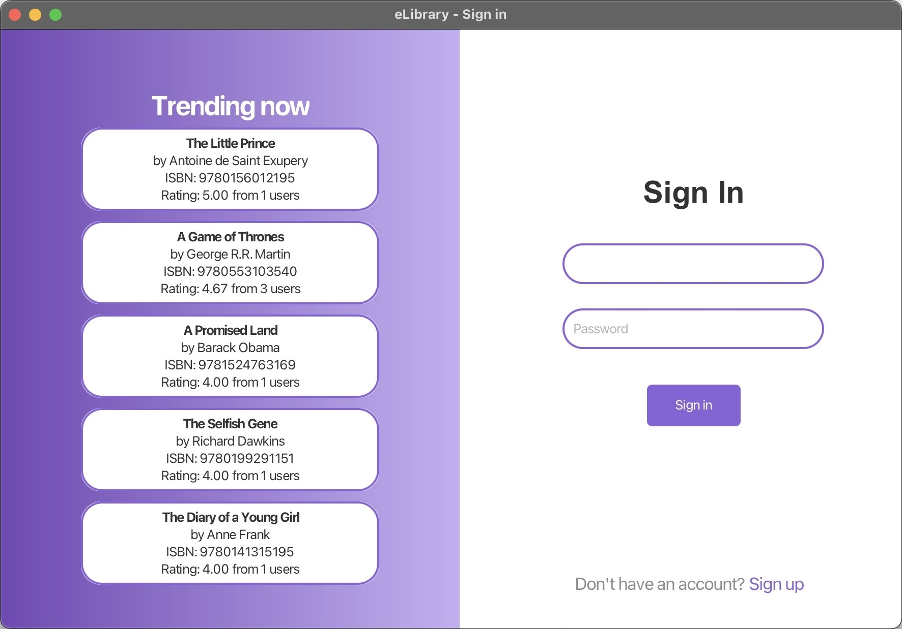
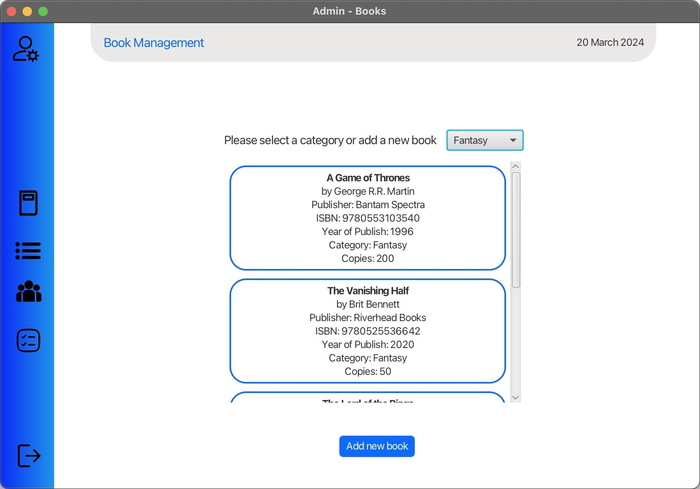
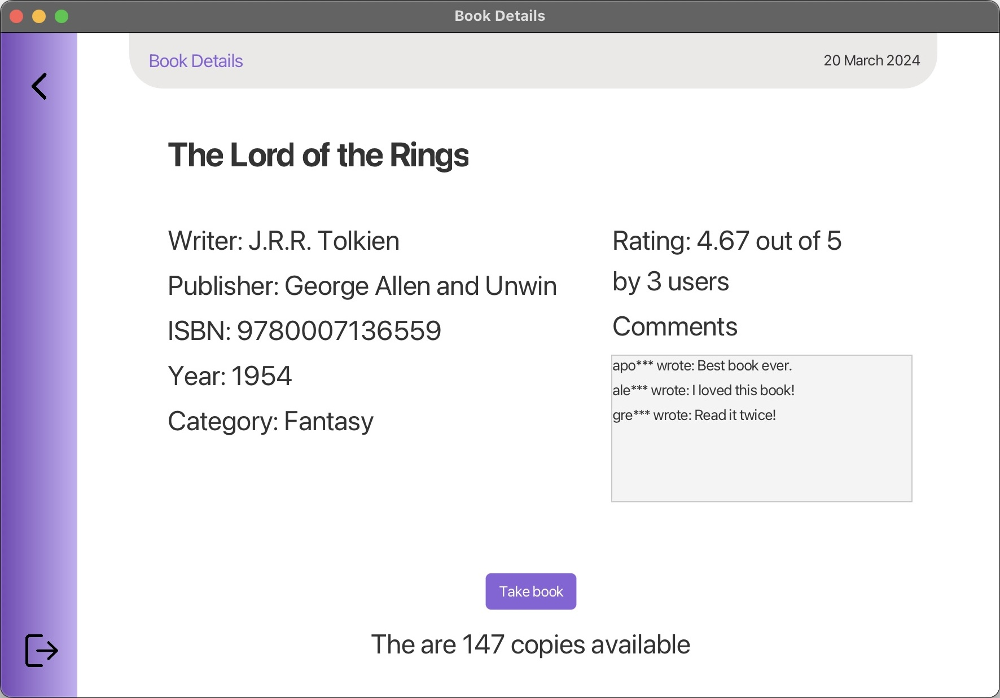
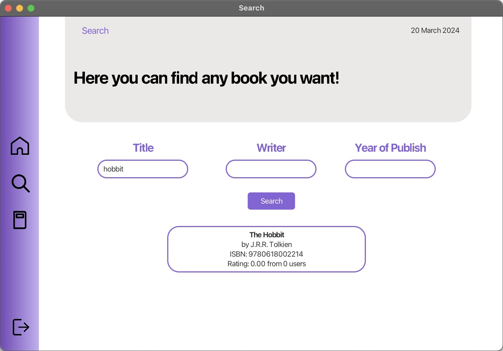

# NTUA ECE Multimedia Project

An implementation of a Library Management System for the Ece Ntua 2023-24 Multimedia course. The project is built using Java and JavaFX, with both admin and user functionalities.

## Table of Contents
1. [Contributors](#contributors)
2. [Tech Stack](#tech-stack)
3. [Screenshots](#screenshots)
4. [Features](#features)
5. [Documentation](#documentation)
6. [Getting Started](#getting-started)
7. [License](#license)

## Contributors
- [Kolios Apostolos](https://github.com/apotolos-k)

## Tech Stack
- **Language**: Java
- **Frontend**: JavaFX

## Screenshots

The following are some screenshots of the application:

- **Login Page**

  

- **Admin Book Management**
  
  

- **User Book Details**
  
  

- **User Book Search**
  
  

## Features

The Library Management System provides two types of user roles: **Admin** and **User**.

### Admin Features:
- **Add Books**: Admins can add new books to the library.
- **Edit Books**: Modify the details of existing books.
- **Delete Books**: Remove books from the library system.
- **Manage Users**: Add, edit, or remove users from the system.

### User Features:
- **Search Books**: Search for books in the library catalog.
- **Borrow Books**: Users can borrow available books.
- **Review Books**: Leave reviews and ratings for books.
- **View Borrowed Books**: View the list of books the user has borrowed.

## Getting Started

To get started with the project, follow these steps:

1. **Clone the repository**:
    ```sh
    git clone https://github.com/apostolos-k/ntua-multimedia-project.git
    cd ntua-multimedia-project
    ```

2. **Set up the environment**:
   Ensure you have Java and JavaFX installed on your system.

3. **Run the application**:
   Compile and run the project through your preferred IDE (such as IntelliJ IDEA or Eclipse) or through the command line:
   ```sh
   javac Main.java
   java Main

## License

This project is licensed under the MIT License - see the [LICENSE](LICENSE) file for details.
